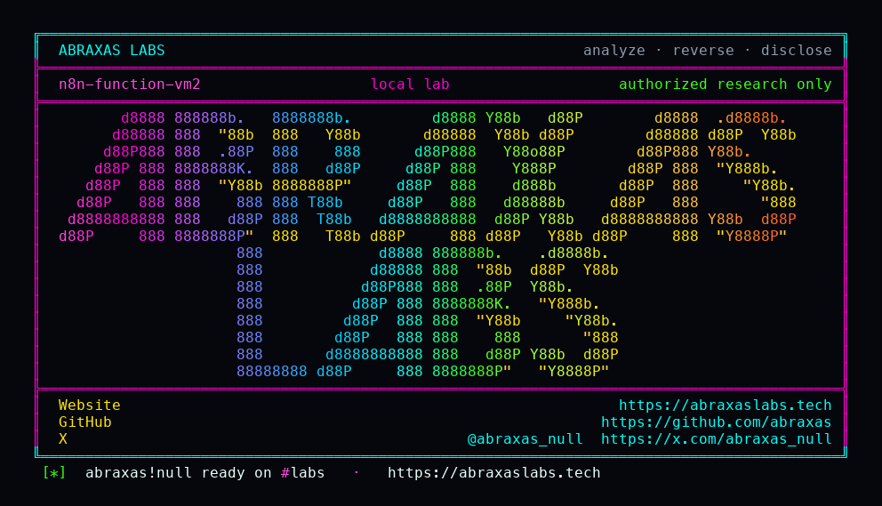

<p align="center">
  
</p>

<p align="center">
  <a href="https://abraxaslabs.tech"><strong>abraxaslabs.tech</strong></a>
  &nbsp;·&nbsp;
  <a href="https://github.com/abraxas">github.com/abraxas</a>
  &nbsp;·&nbsp;
  <a href="https://x.com/abraxas_null">@abraxas_null</a>
  &nbsp;·&nbsp;
  <a href="https://github.com/abraxas/n8n-function-vm2">n8n-function-vm2</a>
</p>

# n8n-function-vm2

**n8n** `2.42.0` — n8n GmbH

Unpublished n8n source finding: hidden Function / FunctionItem / LangChain Code nodes still execute JavaScript via leftover vm2 NodeVM in the n8n main process. Palette hide is not an ACL. Code v2 already runs in the task-runner child. Distinct from GHSA-j4p8, which moved n8n-nodes-base.code only.

| | |
|---|---|
| ID | Unpublished n8n source finding #1 (no CVE yet) |
| CWE | [CWE-94, CWE-269](https://cwe.mitre.org/data/definitions/269.html) |
| CVSS | **High: 8.8** `CVSS:3.1/AV:N/AC:L/PR:L/UI:N/S:U/C:H/I:H/A:H` |
| Product | [n8n](https://github.com/n8n-io/n8n) |
| Affected | all versions **through 2.42.0** (inclusive) |
| Patched | vendor patch — see references |
| Auth | authenticated (see source map) |
| License | [GNU Affero GPL v3.0](LICENSE) |
| Lab | `127.0.0.1` only · vendor/client disclosure pack, not a scanner |

---

## Advisory (from the source map)

Function.node.ts 20-24 hidden:true; 161-180 new NodeVM + vm.run. FunctionItem.node.ts same. @n8n/nodes-langchain code JavaScriptSandbox. Contrast Code.node.ts JsTaskRunnerSandbox. nodes.config.ts 37-38 default exclude executeCommand + localFileTrigger. GHSA-j4p8 moved n8n-nodes-base.code only.

---

## Entry

- **Method:** `POST`
- **Path:** `/rest/workflows`
- **Router:** Hidden Function node still loaded. Palette hidden is not an ACL. Default NODES_EXCLUDE is executeCommand + localFileTrigger. Function.node.ts NodeVM vm.run in the n8n main process.
- **Notes:** Authenticated unpublished n8n #1 CWE-94 n8n@2.42.0. Default member with workflow:create. Witness: Function pid equals n8n main PID; Code v2 process blocked. Do not attach a vm2 exploit gadget. Disclose GitHub Security Advisories only, not a public GitHub issue.

### Call chain

- `POST /rest/owner/setup`
- `POST /rest/invitations role=global:member`
- `POST /rest/invitations/accept`
- `POST /rest/workflows type=n8n-nodes-base.function`
- `POST /rest/workflows/:id/run`
- `GET /rest/executions/:id Function pid == n8n main; Code v2 process blocked`

### Lab preconditions

- n8n 2.42.0 (n8nio/n8n:2.42.0)
- Default NODES_EXCLUDE (Execute Command + Local File Trigger only)
- Attacker is a default member with workflow:create on a personal project
- No extra node allowlist required; hidden Function still loads

### Witness

N8N-FUNCTION-VM2-WITNESS; Function process.pid equals n8n main PID; Code v2 hasProcess false

### Not success

- eval/base64/system payload
- reverse shell
- vm2 exploit gadget in the pack
- Function type rejected as hidden/unknown
- Function pid equals the task-runner child
- OS LPE

---

## Patch / remediation

**Do this first:** Apply the vendor patch for **n8n**. See references.

**Verify after upgrade**

- Re-run `n8n-function-vm2-Abraxas-Labs.py` against the patched build: the mapped witness must **not** appear.
- Confirm the vendor advisory / changeset in the deployed tree (see references).
- A WAF signature is delay, not a patch.

**If you cannot update immediately**

- Disable or isolate the affected component.
- Hunt for the witness condition on production (new privileged users, unexpected files, injected rows — whatever this CVE's map names).

---

## Reproduction (authorized lab)

Target **only** `http://127.0.0.1:18201` (or the loopback you bound). Do not point this script at the internet.

Official image `n8nio/n8n:2.42.0` on loopback `:18201`. Then:

```bash
cd lab
./run.sh
```

Or, with the stack already up:

```bash
python3 n8n-function-vm2-Abraxas-Labs.py http://127.0.0.1:18201
```

Success is the **witness** above in the execution JSON (`N8N-FUNCTION-VM2-WITNESS` and Function pid = n8n main). Generic 200 HTML is not it. This pack does **not** include a vm2 exploit gadget.

---

## Lab images

Loopback stack used to reproduce. Official images unless a `Dockerfile` in this folder builds from source.

- [`lab/docker-compose.yml`](lab/docker-compose.yml)
- [`lab/Dockerfile`](lab/Dockerfile)
- [`lab/run.sh`](lab/run.sh)

Publish nothing except `127.0.0.1`.

---

## References

- [github.com/n8n-io/n8n](https://github.com/n8n-io/n8n) tag n8n@2.42.0
- Sibling leftover: [GHSA-j4p8-h8mh-rh8q](https://github.com/n8n-io/n8n/security/advisories/GHSA-j4p8-h8mh-rh8q) (Code node only)
- Vendor intake: [GitHub Security Advisories](https://github.com/n8n-io/n8n/security/advisories/new). Do **not** open a public GitHub issue.

- Abraxas Labs: [abraxaslabs.tech](https://abraxaslabs.tech) · [github.com/abraxas](https://github.com/abraxas) · [@abraxas_null](https://x.com/abraxas_null)

---

## Records (structured)

```
# n8n unpublished #1 — Hidden Function still vm2 in-process

CWE: CWE-94, CWE-269
Severity: High (HTTP lab SUCCESS, 82%)

## Description

Palette `hidden: true` is not an ACL. `n8n-nodes-base.function` (and FunctionItem / LangChain Code) still compile JS with leftover vm2 `NodeVM` in the n8n main process. Default `NODES_EXCLUDE` is only Execute Command and Local File Trigger. Code v2 already uses the task-runner child with `--disallow-code-generation-from-strings`.

## Product

n8n 2.42.0 (`n8nio/n8n:2.42.0`). Lab oracle: `N8N-FUNCTION-VM2-WITNESS` — Function `process.pid` equals the n8n main PID; Code v2 `hasProcess` is false. Not OS LPE. Do not ship a vm2 gadget.
```

---

## License

This disclosure pack is licensed under the **GNU Affero General Public License v3.0**. See [LICENSE](LICENSE).

---

## Disclaimer

This pack is for **the vendor, the site owner, and licensed labs**. The script talks to `127.0.0.1`. Using it against systems you do not own is not authorized by Abraxas Labs. No warranty.

<p align="center">
  <a href="https://abraxaslabs.tech">abraxaslabs.tech</a> ·
  <a href="https://github.com/abraxas">github.com/abraxas</a> ·
  <a href="https://x.com/abraxas_null">@abraxas_null</a>
</p>
